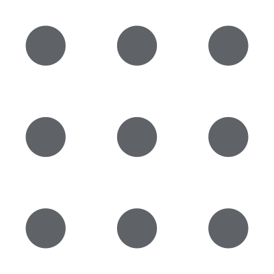

<h1 align="center">
   
  
   
  Menu Dashboard Extension
   
</h1>

<h4 align="center">A modern, minimalist, and adaptive application launcher for your browser.</h4>

Im not thinking on mantaining it but if someone ask for updates or funcionalitys i will certainly do it 

That was just made for fun 

  <a href="#-features">Features</a> •
  <a href="#-installation">Installation</a> •
  <a href="#-how-it-works">How it Works</a> •
  <a href="#-technologies">Technologies</a> •
  

  
  
  

---

## 📸 Preview

  
<i>    
  

    

  </i>
  
  <i>    
  

    

  </i>
  
  

## ✨ Features

* **🎨 Adaptive Colors:** The extension detects your browser's theme color (whether it's Purple, Blue, Black, or White) and automatically adapts the entire UI (background, text, and hover effects) to match it.
* **🌙 Dark/Light Mode:** Native and automatic support for system light and dark modes.
* **🔗 App Management:** Add any website simply by typing the domain (e.g., `youtube.com`). The high-quality icon is fetched automatically.
* **🗑️ Removal Mode:** Intuitive interface to delete unwanted shortcuts.
* **💾 Local Persistence:** Your links are saved in the browser's `localStorage`. No data is sent to external servers.
* **⚡ Lightweight & Fast:** Built with pure Vanilla JS, no heavy frameworks attached.

## 🚀 Installation (Developer Mode)

Since this extension is not yet in the Chrome Web Store, you can install it manually:

1.  **Clone this repository** or download the `.zip` file.
2.  Open your browser (Chrome, Brave, or Edge) and go to:
    * `chrome://extensions`
3.  Enable **Developer mode** in the top right corner.
4.  Click on the **Load unpacked** button.
5.  Select the folder where you saved this project.
6.  Done! The icon will appear in your toolbar.

